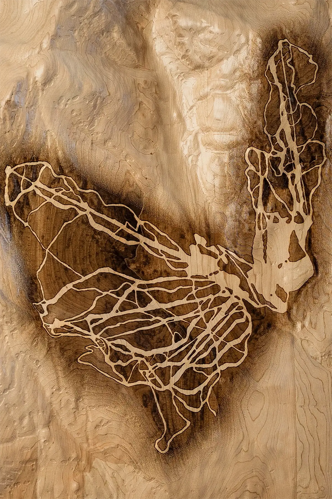

# Codex Task: Gallery Salon Grid - Compact Scale Implementation

## Context & Brand Standards

Bonas Studio creates luxury topographic art ($8,000-15,000). The Gallery page uses a salon-style grid with compact dimensions (max ~400px width) matching the previous scale. Images are frameless hero crops with three standardized aspect ratios creating curator-appropriate size hierarchy.

---

## Design Specifications

### Three Aspect Ratios (Desktop Base Sizes):

**Landscape (3:2)** - Base size
- Desktop display: 400px × 267px
- Use for: Nantucket, Mahoosuc Range, Cape Ann

**Square (1:1)** - 10% smaller than landscape
- Desktop display: 360px × 360px  
- Use for: Middlesex Fells, Cannon Mountain, Highland Mountain

**Portrait (2:3)** - 15% smaller than landscape
- Desktop display: 340px × 510px
- Use for: Mount Mansfield, Block Island, Bromley Mountain, Okemo Mountain

**Size Relationship Rationale:**
Landscape pieces command more visual space (expansive geographic context), portraits have vertical presence requiring less width, squares are balanced between the two.

---

## Responsive Image Variants

Generate 4 image variants per aspect ratio for responsive delivery:

### Landscape (3:2):
| Variant | Width | Height | File Name | Target Device |
|---------|-------|--------|-----------|---------------|
| Small | 300px | 200px | `[piece].hero.crop-300w.webp` | 320-767px viewports |
| Medium | 400px | 267px | `[piece].hero.crop-400w.webp` | 768-1023px viewports |
| Large | 600px | 400px | `[piece].hero.crop-600w.webp` | 1024-1439px viewports |
| XLarge | 800px | 533px | `[piece].hero.crop-800w.webp` | 1440px+ & retina displays |

**Quality & File Sizes:**
- 300w: 85% quality, max 80 KB
- 400w: 88% quality, max 120 KB
- 600w: 92% quality, max 200 KB
- 800w: 95% quality, max 300 KB

---

### Square (1:1):
| Variant | Width | Height | File Name | Target Device |
|---------|-------|--------|-----------|---------------|
| Small | 270px | 270px | `[piece].hero.crop-270w.webp` | 320-767px viewports |
| Medium | 360px | 360px | `[piece].hero.crop-360w.webp` | 768-1023px viewports |
| Large | 540px | 540px | `[piece].hero.crop-540w.webp` | 1024-1439px viewports |
| XLarge | 720px | 720px | `[piece].hero.crop-720w.webp` | 1440px+ & retina displays |

**Quality & File Sizes:**
- 270w: 85% quality, max 70 KB
- 360w: 88% quality, max 110 KB
- 540w: 92% quality, max 180 KB
- 720w: 95% quality, max 280 KB

---

### Portrait (2:3):
| Variant | Width | Height | File Name | Target Device |
|---------|-------|--------|-----------|---------------|
| Small | 260px | 390px | `[piece].hero.crop-260w.webp` | 320-767px viewports |
| Medium | 340px | 510px | `[piece].hero.crop-340w.webp` | 768-1023px viewports |
| Large | 510px | 765px | `[piece].hero.crop-510w.webp` | 1024-1439px viewports |
| XLarge | 680px | 1020px | `[piece].hero.crop-680w.webp` | 1440px+ & retina displays |

**Quality & File Sizes:**
- 260w: 85% quality, max 75 KB
- 340w: 88% quality, max 115 KB
- 510w: 92% quality, max 190 KB
- 680w: 95% quality, max 280 KB

---

## Piece Classification by Aspect Ratio

### Landscape (3:2):
- Nantucket Island
- Mahoosuc Range  
- Cape Ann (if wide coastline composition)

### Square (1:1):
- Middlesex Fells Reservation
- Cannon Mountain
- Highland Mountain
- Cape Ann (if 31"×31" is accurate)

### Portrait (2:3):
- Mount Mansfield
- Block Island
- Bromley Mountain
- Okemo Mountain

---

## Implementation Changes

### 1. HTML Updates (gallery.html)

#### Current Pattern (Remove):
```html
<article class="gallery-item" data-category="alpine" data-width="20" data-height="24">
  <div class="gallery-item-media">
    
  </div>
</article>
```

#### New Pattern (Implement):

**Landscape Example (Nantucket):**
```html
<article class="gallery-item" data-category="coastal" data-aspect="landscape">
  <a href="pieces/nantucket.html" class="gallery-item-link">
    <div class="gallery-item-media">
      
    </div>
    <div class="gallery-item-overlay">
      <h3 class="gallery-item-title">Nantucket Island</h3>
      <p class="gallery-item-meta">Massachusetts</p>
    </div>
  </a>
</article>
```

**Square Example (Middlesex Fells):**
```html
<article class="gallery-item" data-category="urban" data-aspect="square">
  <a href="pieces/fells.html" class="gallery-item-link">
    <div class="gallery-item-media">
      
    </div>
    <div class="gallery-item-overlay">
      <h3 class="gallery-item-title">Middlesex Fells Reservation</h3>
      <p class="gallery-item-meta">Greater Boston, Massachusetts</p>
    </div>
  </a>
</article>
```

**Portrait Example (Mount Mansfield):**
```html
<article class="gallery-item" data-category="alpine" data-aspect="portrait">
  <a href="pieces/mansfield.html" class="gallery-item-link">
    <div class="gallery-item-media">
      
    </div>
    <div class="gallery-item-overlay">
      <h3 class="gallery-item-title">Mount Mansfield</h3>
      <p class="gallery-item-meta">Stowe, Vermont</p>
    </div>
  </a>
</article>
```

**Changes Required:**
- Remove all `data-width` and `data-height` attributes
- Add `data-aspect` attribute (landscape/square/portrait)
- Replace single `src` with `srcset` (3 variants)
- Add `sizes` attribute (matches aspect ratio)
- Add `loading="lazy"` for performance
- Update all image paths to `.hero.crop` variants

---

### 2. CSS Updates (css_pages_gallery.css)

**Replace the entire gallery grid section with:**

```css
/* ============================================
   GALLERY GRID - COMPACT SALON LAYOUT
   Three aspect ratios at curator-appropriate scale
   ============================================ */

.gallery-grid {
  display: grid;
  grid-template-columns: repeat(auto-fill, minmax(280px, 1fr));
  gap: clamp(3rem, 6vw, 5rem);
  justify-items: center;
  padding: var(--space-8) 0;
  max-width: 1400px;
  margin: 0 auto;
}

/* Base gallery item */
.gallery-item {
  position: relative;
  width: 100%;
  opacity: 0;
  transform: translateY(40px) scale(0.95);
  transition: opacity 1.5s ease, transform 1.5s ease;
}

.gallery-item.is-visible {
  opacity: 1;
  transform: translateY(0) scale(1);
}

.gallery-item.hidden {
  display: none;
}

/* Aspect ratio-specific max-widths */
.gallery-item[data-aspect="landscape"] {
  max-width: 400px;
}

.gallery-item[data-aspect="square"] {
  max-width: 360px;
}

.gallery-item[data-aspect="portrait"] {
  max-width: 340px;
}

/* Mobile: smaller versions */
@media (max-width: 767px) {
  .gallery-grid {
    grid-template-columns: 1fr;
    gap: clamp(2.5rem, 5vw, 4rem);
  }

  .gallery-item[data-aspect="landscape"] {
    max-width: 300px;
  }

  .gallery-item[data-aspect="square"] {
    max-width: 270px;
  }

  .gallery-item[data-aspect="portrait"] {
    max-width: 260px;
  }
}

/* Tablet: transition to multi-column */
@media (min-width: 768px) and (max-width: 1023px) {
  .gallery-grid {
    grid-template-columns: repeat(auto-fill, minmax(320px, 1fr));
  }
}

/* Desktop: full scale */
@media (min-width: 1024px) {
  .gallery-grid {
    grid-template-columns: repeat(auto-fill, minmax(340px, 1fr));
  }
}

/* Gallery Item Link */
.gallery-item-link {
  display: block;
  width: 100%;
  text-decoration: none;
  color: inherit;
  cursor: pointer;
}

/* Gallery Item Media Container */
.gallery-item-media {
  position: relative;
  width: 100%;
  overflow: visible;
  background: transparent;
  transition: transform var(--transition-slow);
}

/* Aspect ratios */
.gallery-item[data-aspect="landscape"] .gallery-item-media {
  aspect-ratio: 3 / 2;
}

.gallery-item[data-aspect="square"] .gallery-item-media {
  aspect-ratio: 1 / 1;
}

.gallery-item[data-aspect="portrait"] .gallery-item-media {
  aspect-ratio: 2 / 3;
}

/* Hover effect - subtle lift */
.gallery-item-link:hover .gallery-item-media {
  transform: translateY(-4px);
}

/* Gallery Item Image with Drop Shadow */
.gallery-item-image {
  display: block;
  width: 100%;
  height: 100%;
  object-fit: cover;
  object-position: center;
  box-shadow: 0 12px 40px rgba(0, 0, 0, 0.12);
  transition: box-shadow var(--transition-slow);
}

/* Enhanced shadow on hover */
.gallery-item-link:hover .gallery-item-image {
  box-shadow: 0 16px 60px rgba(0, 0, 0, 0.18);
}

/* Gallery Item Overlay (title/meta below image) */
.gallery-item-overlay {
  padding: var(--space-3) 0 0;
  text-align: center;
}

/* Typography */
.gallery-item-title {
  font-family: var(--font-primary);
  font-size: var(--text-sm);
  font-weight: var(--weight-regular);
  color: var(--color-graphite);
  margin: 0 0 var(--space-1);
  letter-spacing: 0.01em;
}

.gallery-item-meta {
  font-family: var(--font-secondary);
  font-size: var(--text-xs);
  color: var(--color-text-secondary);
  margin: 0;
  opacity: 0.7;
}
```

**Key CSS Changes:**
- Uses CSS Grid with `auto-fill` for responsive columns
- Fixed max-widths per aspect ratio (400/360/340px)
- Aspect ratios defined with CSS `aspect-ratio` property
- Drop shadows on images (12px/40px base, 16px/60px hover)
- No JavaScript-dependent sizing
- Mobile-first responsive breakpoints

---

### 3. JavaScript Updates (gallery.js)

**Remove these functions entirely:**
```javascript
// DELETE:
function setGalleryTrueScale() { ... }
function setGalleryAspectRatios() { ... }
function setVariedSpacing() { ... }
```

**Update initialization to:**
```javascript
// REPLACE THIS:
if (document.readyState === 'loading') {
  document.addEventListener('DOMContentLoaded', () => {
    setGalleryTrueScale();
    setGalleryAspectRatios();
    setVariedSpacing();
    initGalleryFilter();
  });
} else {
  setGalleryTrueScale();
  setGalleryAspectRatios();
  setVariedSpacing();
  initGalleryFilter();
}

// WITH THIS:
if (document.readyState === 'loading') {
  document.addEventListener('DOMContentLoaded', initGalleryFilter);
} else {
  initGalleryFilter();
}
```

**Remove resize listener:**
```javascript
// DELETE:
let resizeTimeout;
window.addEventListener('resize', () => {
  clearTimeout(resizeTimeout);
  resizeTimeout = setTimeout(setGalleryTrueScale, 150);
});
```

**Keep unchanged:**
- `initGalleryFilter()` function
- Lightbox functions (if present)

---

### 4. Remove Scale Note (gallery.html)

**Delete this line:**
```html
<p class="gallery-scale-note fade-in-scroll">Works shown at relative scale to convey physical presence</p>
```

And remove the corresponding CSS in `css_pages_gallery.css`:
```css
/* DELETE: */
.gallery-scale-note { ... }
.gallery-scale-note + .gallery-section.section-padded { ... }
.gallery-scale-note + .gallery-section .gallery-grid { ... }
```

---

## All 11 Gallery Items - Complete HTML

Update each gallery item in `gallery.html` with the new pattern:

### Landscape Pieces:

**1. Nantucket Island:**
```html
<article class="gallery-item" data-category="coastal" data-aspect="landscape">
  <a href="pieces/nantucket.html" class="gallery-item-link">
    <div class="gallery-item-media">
      
    </div>
    <div class="gallery-item-overlay">
      <h3 class="gallery-item-title">Nantucket Island</h3>
      <p class="gallery-item-meta">Massachusetts</p>
    </div>
  </a>
</article>
```

**2. Mahoosuc Range:**
```html
<article class="gallery-item" data-category="alpine" data-aspect="landscape">
  <a href="pieces/mahoosuc.html" class="gallery-item-link">
    <div class="gallery-item-media">
      
    </div>
    <div class="gallery-item-overlay">
      <h3 class="gallery-item-title">Mahoosuc Range</h3>
      <p class="gallery-item-meta">Maine</p>
    </div>
  </a>
</article>
```

**3. Cape Ann:**
```html
<article class="gallery-item" data-category="coastal" data-aspect="landscape">
  <a href="pieces/cape-ann.html" class="gallery-item-link">
    <div class="gallery-item-media">
      
    </div>
    <div class="gallery-item-overlay">
      <h3 class="gallery-item-title">Cape Ann</h3>
      <p class="gallery-item-meta">Massachusetts</p>
    </div>
  </a>
</article>
```

### Square Pieces:

**4. Middlesex Fells:**
```html
<article class="gallery-item" data-category="urban" data-aspect="square">
  <a href="pieces/fells.html" class="gallery-item-link">
    <div class="gallery-item-media">
      
    </div>
    <div class="gallery-item-overlay">
      <h3 class="gallery-item-title">Middlesex Fells Reservation</h3>
      <p class="gallery-item-meta">Greater Boston, Massachusetts</p>
    </div>
  </a>
</article>
```

**5. Cannon Mountain:**
```html
<article class="gallery-item" data-category="alpine" data-aspect="square">
  <a href="pieces/cannon.html" class="gallery-item-link">
    <div class="gallery-item-media">
      
    </div>
    <div class="gallery-item-overlay">
      <h3 class="gallery-item-title">Cannon Mountain</h3>
      <p class="gallery-item-meta">Franconia, New Hampshire</p>
    </div>
  </a>
</article>
```

**6. Highland Mountain:**
```html
<article class="gallery-item" data-category="alpine" data-aspect="square">
  <a href="pieces/highland.html" class="gallery-item-link">
    <div class="gallery-item-media">
      
    </div>
    <div class="gallery-item-overlay">
      <h3 class="gallery-item-title">Highland Mountain</h3>
      <p class="gallery-item-meta">Northfield, New Hampshire</p>
    </div>
  </a>
</article>
```

### Portrait Pieces:

**7. Mount Mansfield:**
```html
<article class="gallery-item" data-category="alpine" data-aspect="portrait">
  <a href="pieces/mansfield.html" class="gallery-item-link">
    <div class="gallery-item-media">
      
    </div>
    <div class="gallery-item-overlay">
      <h3 class="gallery-item-title">Mount Mansfield</h3>
      <p class="gallery-item-meta">Stowe, Vermont</p>
    </div>
  </a>
</article>
```

**8. Block Island:**
```html
<article class="gallery-item" data-category="coastal" data-aspect="portrait">
  <a href="pieces/block.html" class="gallery-item-link">
    <div class="gallery-item-media">
      
    </div>
    <div class="gallery-item-overlay">
      <h3 class="gallery-item-title">Block Island</h3>
      <p class="gallery-item-meta">Rhode Island</p>
    </div>
  </a>
</article>
```

**9. Bromley Mountain:**
```html
<article class="gallery-item" data-category="alpine" data-aspect="portrait">
  <a href="pieces/bromley.html" class="gallery-item-link">
    <div class="gallery-item-media">
      
    </div>
    <div class="gallery-item-overlay">
      <h3 class="gallery-item-title">Bromley Mountain</h3>
      <p class="gallery-item-meta">Peru, Vermont</p>
    </div>
  </a>
</article>
```

**10. Okemo Mountain:**
```html
<article class="gallery-item" data-category="alpine" data-aspect="portrait">
  <a href="pieces/okemo.html" class="gallery-item-link">
    <div class="gallery-item-media">
      
    </div>
    <div class="gallery-item-overlay">
      <h3 class="gallery-item-title">Mount Okemo</h3>
      <p class="gallery-item-meta">Ludlow, Vermont</p>
    </div>
  </a>
</article>
```

---

## Quality Checklist

Before completing, verify:

### Visual Quality:
- [ ] All images use `.hero.crop` versions (frameless)
- [ ] Drop shadows visible on all images (12-16px blur)
- [ ] Aspect ratio size hierarchy clear (landscape > square > portrait)
- [ ] Grid feels compact (~400px max, matching previous scale)
- [ ] No pixelation at desktop size
- [ ] Retina displays show crisp images

### Technical Implementation:
- [ ] All `data-width`/`data-height` removed
- [ ] All items have `data-aspect` attribute
- [ ] All images have 4-variant `srcset`
- [ ] All images have correct `sizes` attribute
- [ ] All images have `loading="lazy"`
- [ ] CSS uses `aspect-ratio` property
- [ ] JavaScript sizing functions removed
- [ ] No console errors

### Responsive Behavior:
- [ ] Mobile (375px): 260-300px images, single column
- [ ] Tablet (768px): Multi-column grid emerges
- [ ] Desktop (1024px+): Full 340-400px scale
- [ ] Smooth transitions between breakpoints
- [ ] Grid adjusts naturally to viewport

### Gallery Aesthetics:
- [ ] Compact salon scale maintained
- [ ] Size variation creates visual rhythm
- [ ] Generous gap spacing (3-5rem)
- [ ] Hover effects subtle (lift + shadow)
- [ ] Filter transitions smooth
- [ ] Feels curated, not cluttered

---

## Files Modified

1. **gallery.html** - Update 11 gallery items
2. **css_pages_gallery.css** - Replace grid system
3. **gallery.js** - Remove sizing functions

---

## Expected Outcome

Gallery page displays:
- Compact salon-style grid (~400px max width)
- Three aspect ratios with curator-appropriate size hierarchy
- Frameless hero crop images with drop shadows
- CSS Grid responsive layout (no JavaScript sizing)
- Proper responsive images for all devices
- Maintains previous compact scale feel
- Clean, systematic, gallery-appropriate presentation
